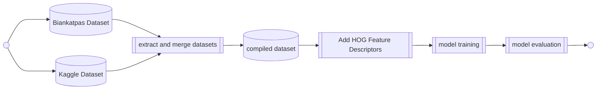
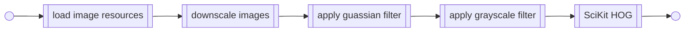
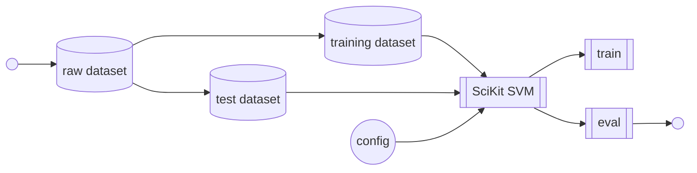

## Workflow

```mermaid
graph LR;


start(( ));
fin(( ));


biankatpas[(Biankatpas Dataset)]
kaggle[(Kaggle Dataset)]

data[[extract and merge datasets]];

db[(compiled dataset)];
features[[Add HOG Feature Descriptors]]

train[[model training]];
eval[[model evaluation]];

start ---> biankatpas --> data;
start ---> kaggle --> data;
data --> db --> features;

features --> train --> eval --> fin;
```

   

## Image Processing Pipeline

```mermaid

graph LR;

start(( ));
fin(( ));

load[[load image resources]]
filter1[[downscale images]]
filter2[[apply guassian filter]]
filter3[[apply grayscale filter]]
hog[[SciKit HOG]];

start --> load;
load --> filter1 --> filter2 --> filter3 --> hog;
hog --> fin;
```

   

## SVM Pipeline

```mermaid

graph LR;

start(( ));
fin(( ));

conf((config));
db[(raw dataset)];
db1[(training dataset)];
db2[(test dataset)];
svm[[SciKit SVM]];
train[[train]];
eval[[eval]];


start --> db;
db ---> db1;
db ---> db2;

db1 --> svm --> train;
db2 ---> svm --> eval --> fin;

conf --> svm;
```

