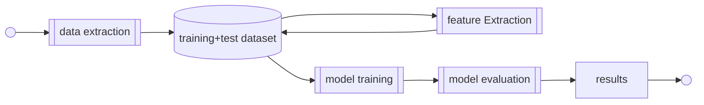
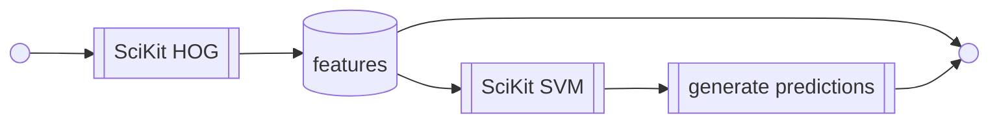

```mermaid
graph LR;


start(( ));
fin(( ));


data[[data extraction]];
db[(training+test dataset)];
features[[feature Extraction]]
train[[model training]];
eval[[model evaluation]];

start --> data --> db;
db --> features ---> db;


db --> train --> eval --> results;

results --> fin;
```

```mermaid

graph LR;

start(( ));
fin(( ));

hog[[SciKit HOG]];
svm[[SciKit SVM]];


start --> hog --> features[(features)] --> fin;

features --> svm --> results[[generate predictions]] --> fin;
```